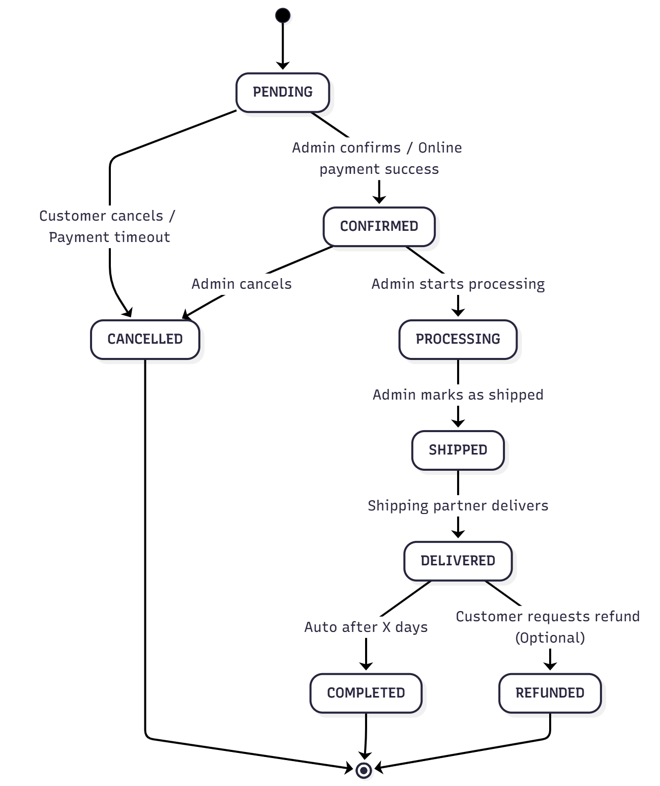

# Tài liệu Phân tích Nghiệp vụ Dự án TechMart Platform

## 1. Tổng quan Dự án

- **Tên Dự án:** TechMart - Nền tảng Thương mại Điện tử Công nghệ
- **Mục tiêu Kinh doanh:**
  - Trở thành một trong những nền tảng E-commerce hàng đầu về đồ công nghệ tại thị trường mục tiêu.
  - Tăng cường trải nghiệm khách hàng thông qua giao diện trực quan, tìm kiếm hiệu quả, và quy trình đặt hàng thuận tiện.
  - Tối ưu hóa quy trình quản lý sản phẩm, tồn kho, và đơn hàng cho nhà bán lẻ.
  - Đảm bảo khả năng mở rộng để đáp ứng tăng trưởng về lượng người dùng và sản phẩm.
- **Phạm vi:**
  - Xây dựng hệ thống B2C (Business-to-Consumer) E-commerce.
  - Tập trung vào các tính năng cốt lõi của một sàn thương mại điện tử: Quản lý người dùng, sản phẩm, giỏ hàng, đặt hàng, thanh toán, quản lý tồn kho, thông báo, và chức năng quản trị cơ bản.
  - Không bao gồm các tính năng phức tạp như hệ thống vận chuyển tích hợp nhiều đối tác, loyalty program, affiliate marketing, đa ngôn ngữ, đa tiền tệ trong giai đoạn đầu.
- **Đối tượng Người dùng:**
  - **Khách hàng (Customer):** Người dùng cá nhân mua sắm sản phẩm.
  - **Quản trị viên (Admin):** Người quản lý hệ thống, sản phẩm, đơn hàng, tồn kho.
  - **Khách vãng lai (Guest):** Người dùng chưa đăng ký/đăng nhập.

## 2. Các yêu cầu Nghiệp vụ (Business Requirements)

### 2.1. Quản lý Người dùng (User Management)

- **FR-UM-001: Đăng ký Tài khoản:**
  - Người dùng có thể đăng ký tài khoản mới bằng email và mật khẩu.
  - Yêu cầu xác nhận email để kích hoạt tài khoản.
  - Sau khi đăng ký, một hồ sơ người dùng cơ bản sẽ được tạo trong hệ thống TechMart.
- **FR-UM-002: Đăng nhập/Đăng xuất:**
  - Người dùng có thể đăng nhập bằng tài khoản đã đăng ký.
  - Hệ thống duy trì trạng thái đăng nhập của người dùng qua session/token.
  - Người dùng có thể đăng xuất khỏi hệ thống.
- **FR-UM-003: Quản lý Hồ sơ Cá nhân:**
  - Người dùng có thể xem và chỉnh sửa thông tin cá nhân: Tên đầy đủ, số điện thoại, email (email có thể yêu cầu xác minh lại).
  - Người dùng không thể thay đổi Keycloak ID.
- **FR-UM-004: Quản lý Địa chỉ Giao hàng:**
  - Người dùng có thể thêm, chỉnh sửa, xóa nhiều địa chỉ giao hàng.
  - Có thể đặt một địa chỉ làm mặc định.
  - Thông tin địa chỉ bao gồm: Tên người nhận, số điện thoại, địa chỉ chi tiết (số nhà, đường), phường/xã, quận/huyện, tỉnh/thành phố.

### 2.2. Quản lý Sản phẩm & Danh mục (Product & Category Management)

- **FR-PM-001: Duyệt Sản phẩm theo Danh mục:**
  - Người dùng có thể duyệt sản phẩm theo danh mục phân cấp (ví dụ: Điện thoại > iPhone > iPhone 15 Pro Max).
  - Mỗi danh mục có thể có danh mục con.
- **FR-PM-002: Tìm kiếm Sản phẩm:**
  - Người dùng có thể tìm kiếm sản phẩm theo từ khóa (tên sản phẩm, mô tả).
  - Hỗ trợ tìm kiếm với gợi ý (autocomplete - optional).
- **FR-PM-003: Lọc & Sắp xếp Sản phẩm:**
  - Người dùng có thể lọc sản phẩm theo: Danh mục, Thương hiệu, Khoảng giá, Các thuộc tính động (RAM, CPU, dung lượng lưu trữ), Trạng thái còn hàng.
  - Người dùng có thể sắp xếp sản phẩm theo: Giá (tăng/giảm), Mới nhất, Phổ biến nhất (lượt xem), Đánh giá trung bình.
- **FR-PM-004: Xem chi tiết Sản phẩm:**
  - Hiển thị tên, mô tả, giá (giá gốc và giá khuyến mãi nếu có), thương hiệu, danh mục.
  - Hiển thị nhiều hình ảnh sản phẩm, cho phép zoom.
  - Hiển thị các phiên bản sản phẩm (Variants) với SKU, giá, màu sắc, dung lượng và số lượng tồn kho khả dụng.
  - Hiển thị các thuộc tính kỹ thuật động (RAM, CPU, màn hình, v.v.).
  - Hiển thị đánh giá trung bình và số lượng review (chức năng review có thể phát triển sau).
- **FR-PM-005: Quản lý Danh mục (Admin):**
  - Admin có thể thêm, sửa, xóa danh mục sản phẩm (bao gồm cấu hình danh mục cha/con).
  - Admin có thể kích hoạt/ngừng kích hoạt danh mục.
- **FR-PM-006: Quản lý Thương hiệu (Admin):**
  - Admin có thể thêm, sửa, xóa thương hiệu sản phẩm.
  - Admin có thể tải lên logo thương hiệu.
- **FR-PM-007: Quản lý Sản phẩm (Admin):**
  - Admin có thể thêm, sửa, xóa sản phẩm (bao gồm tên, mô tả, danh mục, thương hiệu, giá cơ bản).
  - Admin có thể thêm, sửa, xóa các phiên bản sản phẩm (Variants) bao gồm SKU, giá, hình ảnh, thuộc tính riêng.
  - Admin có thể tải lên nhiều hình ảnh cho một sản phẩm.
  - Admin có thể kích hoạt/ngừng kích hoạt sản phẩm.
- **FR-PM-008: Sản phẩm nổi bật/Bán chạy:**
  - Hiển thị các sản phẩm được đánh dấu là nổi bật hoặc được hệ thống gợi ý là bán chạy trên trang chủ hoặc các vị trí khác.

### 2.3. Giỏ hàng (Shopping Cart)

- **FR-SC-001: Thêm sản phẩm vào giỏ:**
  - Người dùng có thể thêm một phiên bản sản phẩm (product variant) vào giỏ hàng.
  - Hệ thống kiểm tra số lượng tồn kho khả dụng trước khi thêm.
  - Nếu sản phẩm đã có trong giỏ, tăng số lượng.
- **FR-SC-002: Cập nhật số lượng sản phẩm trong giỏ:**
  - Người dùng có thể thay đổi số lượng của một sản phẩm trong giỏ hàng.
  - Hệ thống kiểm tra lại số lượng tồn kho khả dụng.
- **FR-SC-003: Xóa sản phẩm khỏi giỏ:**
  - Người dùng có thể xóa một sản phẩm khỏi giỏ hàng.
- **FR-SC-004: Xem giỏ hàng:**
  - Hiển thị danh sách sản phẩm trong giỏ, số lượng, giá từng sản phẩm, tổng giá tạm tính (subtotal).
  - Hiển thị tổng số lượng sản phẩm và tổng giá trị giỏ hàng.
- **FR-SC-005: Xóa toàn bộ giỏ hàng:**
  - Người dùng có thể xóa tất cả sản phẩm trong giỏ.
- **FR-SC-006: Duy trì giỏ hàng:**
  - **Khách vãng lai:** Giỏ hàng được lưu trữ tạm thời (session-based) trên Redis với TTL 24h.
  - **Người dùng đã đăng ký:** Giỏ hàng được lưu trữ persistent trong MySQL và được cache trên Redis.
- **FR-SC-007: Merge giỏ hàng:**
  - Khi khách vãng lai đăng nhập, giỏ hàng session của họ sẽ được merge vào giỏ hàng persistent của người dùng. Ưu tiên số lượng trong giỏ session nếu có xung đột, hoặc cộng dồn nếu sản phẩm khác SKU.

### 2.4. Đặt hàng & Thanh toán (Order Processing & Payment)

- **FR-OP-001: Thanh toán (Checkout):**
  - Người dùng có thể tiến hành thanh toán từ trang giỏ hàng.
  - Người dùng phải chọn địa chỉ giao hàng (sử dụng địa chỉ đã lưu hoặc thêm địa chỉ mới).
  - Người dùng phải chọn phương thức thanh toán: COD (Thanh toán khi nhận hàng), VNPay, Momo (có thể mở rộng).
  - Người dùng có thể nhập mã giảm giá/coupon (nếu có).
  - Hệ thống hiển thị tổng tiền cần thanh toán bao gồm: Tổng tiền sản phẩm, phí vận chuyển, giảm giá (nếu có).
  - Hệ thống kiểm tra lại số lượng tồn kho cuối cùng trước khi tạo đơn hàng.
- **FR-OP-002: Tạo Đơn hàng:**
  - Sau khi xác nhận thanh toán, một đơn hàng sẽ được tạo với `Order Number` duy nhất.
  - Trạng thái ban đầu của đơn hàng là `PENDING`.
  - Nếu thanh toán online, người dùng sẽ được chuyển hướng đến cổng thanh toán.
- **FR-OP-003: Xử lý Thanh toán Online (VNPay/Momo):**
  - Hệ thống gửi request đến cổng thanh toán VNPay/Momo.
  - Sau khi thanh toán thành công, cổng thanh toán sẽ gửi callback (webhook) về hệ thống TechMart để cập nhật trạng thái thanh toán và đơn hàng.
  - Nếu thanh toán thành công, trạng thái đơn hàng chuyển từ `PENDING` sang `CONFIRMED`, `paymentStatus` chuyển sang `PAID`.
  - Nếu thanh toán thất bại, trạng thái `paymentStatus` là `FAILED`, và đơn hàng có thể bị `CANCELLED`.
- **FR-OP-004: Quản lý Trạng thái Đơn hàng:**
  - Hệ thống tự động hoặc Admin cập nhật trạng thái đơn hàng theo luồng: `PENDING` → `CONFIRMED` → `PROCESSING` → `SHIPPED` → `DELIVERED` → `COMPLETED`.
  - Đơn hàng có thể chuyển sang `CANCELLED` từ trạng thái `PENDING` hoặc `CONFIRMED`.
  - `COMPLETED` tự động sau X ngày kể từ `DELIVERED`.
- **FR-OP-005: Xem Lịch sử Đơn hàng:**
  - Người dùng có thể xem danh sách tất cả các đơn hàng đã đặt, bao gồm trạng thái hiện tại.
  - Có thể lọc theo trạng thái đơn hàng.
- **FR-OP-006: Xem chi tiết Đơn hàng:**
  - Hiển thị đầy đủ thông tin về đơn hàng: `Order Number`, trạng thái, tổng tiền, danh sách sản phẩm, địa chỉ giao hàng, phương thức thanh toán, lịch sử thay đổi trạng thái.
- **FR-OP-007: Hủy Đơn hàng:**
  - Người dùng có thể hủy đơn hàng nếu trạng thái là `PENDING` hoặc `CONFIRMED`.
  - Admin có thể hủy đơn hàng ở các trạng thái khác nhau với lý do cụ thể.
  - Khi hủy đơn, tồn kho sản phẩm sẽ được hoàn lại (release).
  - Nếu đơn đã thanh toán, sẽ cần quy trình hoàn tiền (refund - optional, có thể đơn giản hóa).
- **FR-OP-008: Quản lý Đơn hàng (Admin):**
  - Admin có thể xem danh sách tất cả các đơn hàng, lọc theo trạng thái, ngày đặt, khách hàng.
  - Admin có thể xem chi tiết đơn hàng.
  - Admin có thể cập nhật trạng thái đơn hàng (xác nhận, xử lý, giao hàng, hoàn thành, hủy bỏ) và thêm ghi chú.

### 2.5. Quản lý Tồn kho (Inventory Management)

- **FR-IM-001: Theo dõi Tồn kho:**
  - Hệ thống theo dõi số lượng tồn kho khả dụng (`available_quantity`), số lượng đã đặt trước (`reserved_quantity`), và số lượng đã bán (`sold_quantity`) cho mỗi phiên bản sản phẩm (variant).
- **FR-IM-002: Đặt trước Tồn kho (Reserve):**
  - Khi một đơn hàng được `CONFIRMED`, hệ thống sẽ đặt trước số lượng sản phẩm tương ứng, giảm `available_quantity` và tăng `reserved_quantity`.
  - Nếu không đủ tồn kho, đơn hàng không thể `CONFIRMED` (hoặc có thể được chuyển sang trạng thái `OUT_OF_STOCK` và chờ bổ sung).
- **FR-IM-003: Giải phóng Tồn kho (Release):**
  - Khi một đơn hàng bị `CANCELLED` hoặc hết hạn thanh toán, số lượng sản phẩm đã đặt trước sẽ được giải phóng, tăng `available_quantity` và giảm `reserved_quantity`.
- **FR-IM-004: Xác nhận Bán hàng (Confirm Sale):**
  - Khi đơn hàng được `DELIVERED` (hoặc `COMPLETED`), số lượng sản phẩm đã đặt trước sẽ chuyển thành `sold_quantity`, và `reserved_quantity` giảm.
- **FR-IM-005: Nhập kho (Restock - Admin):**
  - Admin có thể nhập thêm số lượng sản phẩm vào kho, tăng `available_quantity`.
- **FR-IM-006: Cảnh báo Tồn kho thấp:**
  - Hệ thống tự động gửi cảnh báo cho Admin khi số lượng `available_quantity` của một sản phẩm giảm xuống dưới một ngưỡng nhất định (ví dụ: 10 đơn vị).

### 2.6. Hệ thống Thông báo (Notification System)

- **FR-NT-001: Thông báo trong ứng dụng:**
  - Người dùng nhận được thông báo về các sự kiện quan trọng trong ứng dụng (ví dụ: đơn hàng được xác nhận, đơn hàng đã gửi, đơn hàng đã giao).
  - Hiển thị danh sách thông báo và trạng thái đọc/chưa đọc.
  - Người dùng có thể đánh dấu đã đọc hoặc đánh dấu tất cả đã đọc.
- **FR-NT-002: Thông báo qua Email:**
  - Hệ thống gửi email xác nhận đơn hàng khi đơn hàng `CONFIRMED`.
  - Gửi email thông báo khi đơn hàng `SHIPPED` hoặc `DELIVERED`.
  - Gửi email chào mừng khi người dùng đăng ký tài khoản mới.

### 2.7. Quản lý Khuyến mãi (Promotion Management - Optional/Đơn giản hóa)

- **FR-PR-001: Áp dụng mã Coupon:**
  - Người dùng có thể nhập mã coupon tại bước thanh toán để nhận giảm giá.
  - Hệ thống kiểm tra tính hợp lệ của coupon (còn hạn, số lượng, điều kiện áp dụng).
  - Coupon có thể giảm giá theo phần trăm hoặc số tiền cố định.
- **FR-PR-002: Flash Sale (Đơn giản):**
  - Hệ thống có thể chạy các chương trình giảm giá flash sale cho một số sản phẩm trong khoảng thời gian nhất định với số lượng giới hạn.
  - Áp dụng cơ chế rate limiting và distributed lock để xử lý đồng thời.

## 3. Quy tắc Nghiệp vụ (Business Rules)

- **BR-1001 (Sản phẩm):** Mỗi sản phẩm phải thuộc về một danh mục và có ít nhất một phiên bản (variant).
- **BR-1002 (Sản phẩm):** SKU của mỗi phiên bản sản phẩm phải là duy nhất.
- **BR-1003 (Sản phẩm):** Giá của một phiên bản sản phẩm phải luôn lớn hơn 0.
- **BR-2001 (Giỏ hàng):** Số lượng sản phẩm thêm vào giỏ hàng không được vượt quá số lượng tồn kho khả dụng.
- **BR-2002 (Giỏ hàng):** Giỏ hàng của khách vãng lai sẽ tự động hết hạn sau 24 giờ không hoạt động.
- **BR-3001 (Đơn hàng):** `Order Number` phải là duy nhất trên toàn hệ thống.
- **BR-3002 (Đơn hàng):** Giá trị tối thiểu của một đơn hàng là 50,000 VND (chưa tính phí ship) để có thể đặt hàng.
- **BR-3003 (Đơn hàng):** Phí vận chuyển là 30,000 VND cho các đơn hàng dưới 500,000 VND. Miễn phí vận chuyển cho đơn hàng từ 500,000 VND trở lên.
- **BR-3004 (Đơn hàng):** Trạng thái đơn hàng chỉ có thể chuyển đổi theo luồng đã định: `PENDING` → `CONFIRMED` → `PROCESSING` → `SHIPPED` → `DELIVERED` → `COMPLETED` (hoặc `CANCELLED` từ `PENDING`/`CONFIRMED`).
- **BR-3005 (Đơn hàng):** Không thể hủy đơn hàng nếu trạng thái đã là `PROCESSING` hoặc cao hơn.
- **BR-3006 (Thanh toán):** Nếu phương thức thanh toán là COD, `payment_status` là `UNPAID` ban đầu và sẽ chuyển sang `PAID` khi đơn hàng `DELIVERED`.
- **BR-3007 (Thanh toán):** Nếu thanh toán online thất bại, đơn hàng sẽ chuyển sang `CANCELLED` và tồn kho được giải phóng.
- **BR-4001 (Tồn kho):** `available_quantity` và `reserved_quantity` không bao giờ được nhỏ hơn 0.
- **BR-4002 (Tồn kho):** Tồn kho phải được đặt trước (reserved) trước khi đơn hàng chuyển sang `CONFIRMED`.
- **BR-4003 (Tồn kho):** Tồn kho phải được giải phóng (released) khi đơn hàng bị `CANCELLED`.
- **BR-4004 (Tồn kho):** Số lượng bán ra (`sold_quantity`) chỉ tăng khi đơn hàng `DELIVERED` hoặc `COMPLETED`.
- **BR-5001 (Khuyến mãi):** Mã coupon chỉ có thể được sử dụng một lần trên mỗi tài khoản người dùng cho một chương trình khuyến mãi cụ thể.
- **BR-5002 (Khuyến mãi):** Mã coupon phải còn hạn và đáp ứng các điều kiện áp dụng (ví dụ: giá trị đơn hàng tối thiểu).

## 4. Danh sách các Use Case

Dưới đây là một số Use Case tiêu biểu, được xây dựng theo định dạng chuẩn:

### 4.1. Use Case: Đăng ký Tài khoản

- **ID:** UC-001
- **Tên:** Đăng ký Tài khoản
- **Actor:** Khách hàng
- **Mục tiêu:** Tạo một tài khoản người dùng mới trên TechMart.
- **Điều kiện tiên quyết:** Người dùng chưa có tài khoản.
- **Luồng cơ bản:**
  1.  Khách hàng chọn "Đăng ký" trên giao diện.
  2.  Hệ thống hiển thị form đăng ký (email, mật khẩu, xác nhận mật khẩu).
  3.  Khách hàng nhập thông tin và gửi form.
  4.  Hệ thống chuyển hướng Khách hàng đến trang đăng ký của Keycloak.
  5.  Khách hàng điền thông tin và xác nhận.
  6.  Keycloak tạo tài khoản và gửi email xác minh đến email của Khách hàng.
  7.  Khách hàng xác minh email.
  8.  Keycloak thông báo đăng ký thành công và Khách hàng được chuyển hướng về TechMart.
  9.  TechMart (User Service) tự động đồng bộ hồ sơ Khách hàng.
- **Luồng thay thế:**
  - **ALT-1.1 (Email đã tồn tại):** Nếu email đã được đăng ký, Keycloak thông báo lỗi.
  - **ALT-1.2 (Mật khẩu không khớp):** Hệ thống hiển thị lỗi yêu cầu nhập lại mật khẩu.
  - **ALT-1.3 (Xác minh email thất bại/hết hạn):** Khách hàng có thể yêu cầu gửi lại email xác minh.

### 4.2. Use Case: Tìm kiếm Sản phẩm

- **ID:** UC-002
- **Tên:** Tìm kiếm Sản phẩm
- **Actor:** Khách hàng, Khách vãng lai
- **Mục tiêu:** Tìm thấy các sản phẩm mong muốn dựa trên tiêu chí tìm kiếm.
- **Điều kiện tiên quyết:** Không có.
- **Luồng cơ bản:**
  1.  Actor nhập từ khóa vào ô tìm kiếm.
  2.  Hệ thống hiển thị danh sách sản phẩm gợi ý (optional).
  3.  Actor nhấn Enter hoặc nút tìm kiếm.
  4.  Hệ thống hiển thị trang kết quả tìm kiếm với danh sách sản phẩm phù hợp.
  5.  Actor có thể áp dụng các bộ lọc (giá, danh mục, thương hiệu, v.v.) và sắp xếp kết quả.
  6.  Hệ thống cập nhật danh sách sản phẩm theo các tiêu chí mới.
- **Luồng thay thế:**
  - **ALT-2.1 (Không tìm thấy sản phẩm):** Hệ thống hiển thị thông báo "Không tìm thấy sản phẩm nào" và các gợi ý liên quan.
  - **ALT-2.2 (Sử dụng bộ lọc):** Actor chọn các bộ lọc từ thanh bên (sidebar) hoặc header.

### 4.3. Use Case: Thêm Sản phẩm vào Giỏ hàng

- **ID:** UC-003
- **Tên:** Thêm Sản phẩm vào Giỏ hàng
- **Actor:** Khách hàng, Khách vãng lai
- **Mục tiêu:** Đưa một sản phẩm vào giỏ hàng để chuẩn bị mua.
- **Điều kiện tiên quyết:** Sản phẩm có sẵn trong kho.
- **Luồng cơ bản:**
  1.  Actor xem trang chi tiết sản phẩm.
  2.  Actor chọn phiên bản sản phẩm (variant) và số lượng mong muốn.
  3.  Actor nhấp nút "Thêm vào giỏ hàng".
  4.  Hệ thống kiểm tra số lượng tồn kho khả dụng cho phiên bản sản phẩm đó.
  5.  Nếu đủ tồn kho, sản phẩm được thêm vào giỏ.
  6.  Hệ thống hiển thị thông báo "Đã thêm sản phẩm vào giỏ hàng" và cập nhật icon giỏ hàng.
- **Luồng thay thế:**
  - **ALT-3.1 (Không đủ tồn kho):** Hệ thống hiển thị thông báo lỗi "Không đủ số lượng tồn kho. Chỉ còn X sản phẩm."
  - **ALT-3.2 (Sản phẩm đã có trong giỏ):** Hệ thống tăng số lượng của sản phẩm đó trong giỏ thay vì thêm mới.
  - **ALT-3.3 (Thêm vào giỏ thất bại):** Hệ thống hiển thị lỗi chung và yêu cầu thử lại.

### 4.4. Use Case: Đặt hàng và Thanh toán

- **ID:** UC-004
- **Tên:** Đặt hàng và Thanh toán
- **Actor:** Khách hàng
- **Mục tiêu:** Hoàn tất quá trình mua sắm và tạo một đơn hàng mới.
- **Điều kiện tiên quyết:**
  - Khách hàng đã đăng nhập.
  - Giỏ hàng có ít nhất một sản phẩm hợp lệ và đủ số lượng tồn kho.
  - Tổng giá trị đơn hàng đạt mức tối thiểu (50,000 VND).
- **Luồng cơ bản:**
  1.  Khách hàng vào trang giỏ hàng và nhấp "Tiến hành Thanh toán".
  2.  Hệ thống chuyển Khách hàng đến trang Checkout.
  3.  Khách hàng chọn/xác nhận địa chỉ giao hàng.
  4.  Khách hàng chọn phương thức thanh toán (COD, VNPay, Momo).
  5.  Khách hàng nhập mã giảm giá (nếu có) và áp dụng.
  6.  Hệ thống hiển thị tổng tiền cần thanh toán cuối cùng (có phí ship, giảm giá).
  7.  Khách hàng nhấp "Hoàn tất Đặt hàng".
  8.  Hệ thống kiểm tra lại tồn kho và tạo đơn hàng (`PENDING`).
  9.  **Nếu COD:** Hệ thống tạo đơn hàng, thông báo thành công và gửi email xác nhận.
  10. **Nếu VNPay/Momo:** Hệ thống chuyển hướng Khách hàng đến cổng thanh toán tương ứng.
  11. Khách hàng hoàn tất thanh toán trên cổng.
  12. Cổng thanh toán gửi callback về TechMart.
  13. TechMart cập nhật trạng thái đơn hàng (`CONFIRMED`, `PAID`) và gửi email xác nhận.
  14. Hệ thống hiển thị trang xác nhận đơn hàng với mã đơn hàng.
- **Luồng thay thế:**
  - **ALT-4.1 (Không đủ tồn kho trong quá trình checkout):** Hệ thống thông báo sản phẩm X không đủ số lượng, yêu cầu Khách hàng điều chỉnh giỏ hàng.
  - **ALT-4.2 (Mã giảm giá không hợp lệ):** Hệ thống thông báo lỗi về mã giảm giá.
  - **ALT-4.3 (Thanh toán online thất bại):** Cổng thanh toán báo lỗi, TechMart cập nhật đơn hàng là `CANCELLED`, tồn kho được hoàn lại. Khách hàng được chuyển hướng về trang lỗi.

## 5. Danh sách các màn hình giao diện (User Interface - UI)

### 5.1. Giao diện Người dùng (Customer Interface - ReactJS)

- **Trang chủ:**
  - Header: Logo, thanh tìm kiếm, giỏ hàng (số lượng item), icon người dùng (đăng nhập/đăng ký).
  - Banner quảng cáo.
  - Danh sách sản phẩm nổi bật, bán chạy.
  - Danh mục sản phẩm.
  - Footer: Thông tin liên hệ, chính sách, v.v.
- **Trang Danh sách Sản phẩm:**
  - Thanh tìm kiếm, bộ lọc (filter), sắp xếp (sort).
  - Hiển thị danh sách sản phẩm dạng lưới hoặc danh sách.
  - Phân trang (Pagination).
- **Trang Chi tiết Sản phẩm:**
  - Hình ảnh sản phẩm (gallery, zoom).
  - Tên, giá, mô tả, thông số kỹ thuật.
  - Bộ chọn phiên bản sản phẩm (variant), số lượng.
  - Nút "Thêm vào giỏ hàng".
  - Phần gợi ý sản phẩm liên quan.
- **Trang Giỏ hàng:**
  - Danh sách sản phẩm trong giỏ (tên, hình ảnh, giá, số lượng, subtotal).
  - Chức năng cập nhật số lượng, xóa sản phẩm.
  - Tổng tiền, phí vận chuyển ước tính.
  - Nút "Tiến hành Thanh toán".
- **Trang Thanh toán (Checkout):** (Multi-step form)
  - **Step 1: Địa chỉ Giao hàng:** Chọn địa chỉ có sẵn hoặc thêm mới.
  - **Step 2: Phương thức Thanh toán:** Chọn COD, VNPay, Momo.
  - **Step 3: Tổng quan Đơn hàng:** Xem lại danh sách sản phẩm, địa chỉ, phương thức thanh toán, tổng tiền, ô nhập mã giảm giá.
  - Nút "Hoàn tất Đặt hàng".
- **Trang Lịch sử Đơn hàng:**
  - Danh sách các đơn hàng của người dùng.
  - Hiển thị mã đơn hàng, ngày đặt, tổng tiền, trạng thái.
  - Chức năng lọc theo trạng thái.
- **Trang Chi tiết Đơn hàng:**
  - Hiển thị tất cả thông tin chi tiết về một đơn hàng cụ thể.
  - Lịch sử thay đổi trạng thái đơn hàng.
  - Nút "Hủy đơn hàng" (nếu hợp lệ).
- **Trang Hồ sơ Cá nhân:**
  - Thông tin cá nhân (email, tên, số điện thoại).
  - Quản lý địa chỉ giao hàng.
  - Lịch sử đơn hàng (liên kết).
- **Trang Đăng ký/Đăng nhập.**
- **Trang Thông báo.**

### 5.2. Giao diện Quản trị (Admin Dashboard - ReactJS)

- **Dashboard Tổng quan:** Thống kê cơ bản (số đơn hàng, doanh thu, sản phẩm bán chạy).
- **Quản lý Sản phẩm:**
  - Danh sách sản phẩm với chức năng tìm kiếm, lọc.
  - Form thêm/sửa sản phẩm (tên, mô tả, danh mục, thương hiệu, giá cơ bản, hình ảnh).
  - Form quản lý phiên bản sản phẩm (variants) và tồn kho ban đầu.
  - Quản lý danh mục và thương hiệu.
- **Quản lý Đơn hàng:**
  - Danh sách đơn hàng với chức năng tìm kiếm, lọc theo trạng thái, khách hàng, ngày.
  - Xem chi tiết đơn hàng.
  - Chức năng cập nhật trạng thái đơn hàng (xác nhận, xử lý, giao hàng, hoàn thành, hủy bỏ) với ghi chú.
- **Quản lý Tồn kho:**
  - Danh sách tồn kho theo variant, hiển thị số lượng khả dụng, đặt trước.
  - Báo cáo tồn kho thấp.
  - Chức năng nhập kho.
- **Quản lý Người dùng (Admin View):**
  - Danh sách người dùng.
  - Xem thông tin người dùng.
- **Quản lý Khuyến mãi (Đơn giản):**
  - Danh sách coupon code, tạo mới coupon.
  - Cấu hình flash sale (sản phẩm, thời gian, số lượng).

## 6. Giao tiếp Hệ thống (System Interactions)

### 6.1. Sơ đồ Hoạt động (Activity Diagram)

- **Activity Diagram: Quy trình Đặt hàng & Thanh toán**
  1.  [Customer] Chọn sản phẩm & Số lượng -> [Cart Service] Cập nhật giỏ hàng.
  2.  [Customer] Đến trang Checkout -> [Order Service] Lấy thông tin giỏ hàng, tính toán tổng tiền.
  3.  [Customer] Chọn Địa chỉ & PTTT, Nhập Coupon -> [Order Service] Validate địa chỉ, coupon.
  4.  [Customer] Xác nhận Đặt hàng -> [Order Service]
      - Tạo đơn hàng (Status: PENDING, PaymentStatus: UNPAID).
      - [Order Service] Publish `order.created` event -> [Kafka].
      - [Inventory Service] Consume `order.created` -> Reserve Inventory.
      - [Inventory Service] Publish `inventory.reserved` event -> [Kafka].
      - [Notification Service] Consume `order.created` -> Gửi email xác nhận ban đầu.
  5.  **Nếu PTTT = COD:** [Order Service] Cập nhật status `CONFIRMED`.
  6.  **Nếu PTTT = Online (VNPay/Momo):**
      - [Order Service] Gửi request đến cổng thanh toán.
      - [Payment Gateway] Hiển thị trang thanh toán cho [Customer].
      - [Customer] Thanh toán trên cổng.
      - [Payment Gateway] Gửi callback (webhook) đến [Order Service].
      - [Order Service] Xử lý callback:
        - **Nếu thành công:** Cập nhật PaymentStatus `PAID`, Order Status `CONFIRMED`.
        - **Nếu thất bại:** Cập nhật PaymentStatus `FAILED`, Order Status `CANCELLED`, [Order Service] Publish `order.cancelled` -> [Kafka].
  7.  [Order Service] Sau khi `CONFIRMED` -> [Admin] Có thể bắt đầu xử lý đơn hàng: `PROCESSING` -> `SHIPPED` -> `DELIVERED`.
  8.  Khi đơn hàng `DELIVERED` -> [Order Service] Cập nhật PaymentStatus `PAID` (cho COD), [Order Service] Publish `order.delivered` -> [Kafka].
  9.  [Inventory Service] Consume `order.delivered` -> Confirm Sale (giảm `reserved_quantity`, tăng `sold_quantity`).
  10. [Notification Service] Consume `order.delivered` -> Gửi email xác nhận giao hàng.
  11. [Order Service] Sau X ngày kể từ `DELIVERED` -> Cập nhật status `COMPLETED`.

### 6.2. Sơ đồ Trạng thái (State Diagram)

- **State Diagram: Trạng thái Đơn hàng**

