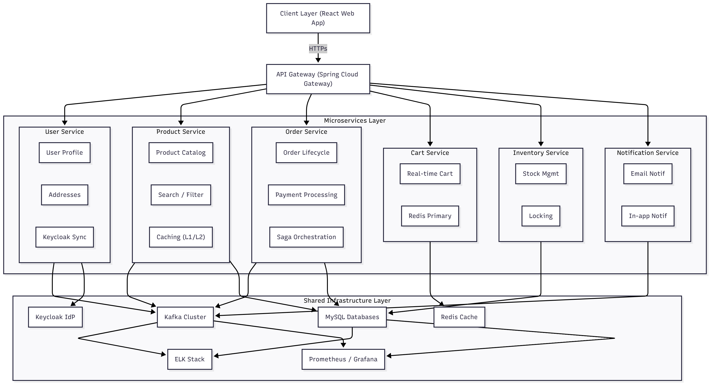

# Tài liệu Kỹ thuật Dự án TechMart Platform

## 1. Overview

### 1.1. Purpose and Scope

Tài liệu này cung cấp cái nhìn tổng quan và chi tiết về kiến trúc kỹ thuật, thiết kế hệ thống, và các thành phần công nghệ được áp dụng trong dự án xây dựng nền tảng thương mại điện tử TechMart. Mục tiêu của TechMart là cung cấp một platform bán hàng trực tuyến chuyên về các sản phẩm công nghệ và phụ kiện, với khả năng mở rộng, hiệu năng cao, và bảo mật vững chắc, đáp ứng được các yêu cầu nghiệp vụ phức tạp trong ngành bán lẻ trực tuyến.

Phạm vi của tài liệu này bao gồm mô tả kiến trúc microservices, lựa chọn công nghệ, thiết kế cơ sở dữ liệu, luồng xử lý yêu cầu, chiến lược caching, cơ chế xác thực/ủy quyền, hệ thống logging/monitoring và chiến lược kiểm thử.

### 1.2. Project Identity

- **Tên dự án:** TechMart - Nền tảng Thương mại Điện tử Công nghệ
- **Mô tả:** Hệ thống thương mại điện tử chuyên bán đồ công nghệ (laptop, điện thoại, phụ kiện) với kiến trúc microservices, tích hợp các công nghệ hiện đại như Spring Boot, Kafka, Redis, Keycloak, Kubernetes, và ELK Stack.
- **Mục tiêu chính:**
  - Cung cấp trải nghiệm mua sắm trực tuyến mượt mà cho khách hàng.
  - Hỗ trợ quản lý sản phẩm, giỏ hàng, đơn hàng, thanh toán và khuyến mãi hiệu quả cho quản trị viên.
  - Xây dựng hệ thống có khả năng chịu tải cao và dễ dàng mở rộng trong tương lai.
  - Áp dụng các mô hình kiến trúc và kỹ thuật tiên tiến để đảm bảo chất lượng code và maintainability.
- **Đối tượng người dùng:** Khách vãng lai, Khách hàng đăng ký, Quản trị viên.

### 1.3. High-Level Architecture

Dự án TechMart được xây dựng trên kiến trúc Microservices, bao gồm nhiều dịch vụ nhỏ, độc lập, có thể triển khai và mở rộng riêng biệt. Các dịch vụ giao tiếp với nhau chủ yếu thông qua API REST và cơ chế truyền tải sự kiện bất đồng bộ qua Kafka.

 _(Đây là placeholder, bạn có thể thay thế bằng đường dẫn hình ảnh thực tế)_

**Các thành phần chính:**

- **Client Applications:** Giao diện người dùng được xây dựng bằng ReactJS cho cả khách hàng và Admin.
- **API Gateway:** Điểm vào duy nhất cho tất cả các yêu cầu từ client, chịu trách nhiệm định tuyến, xác thực, ủy quyền cơ bản và giới hạn tốc độ.
- **Microservices:** Các dịch vụ backend chuyên biệt xử lý từng nghiệp vụ cụ thể (User, Product, Order, Cart, Inventory, Notification).
- **Identity Provider:** Keycloak để quản lý xác thực và ủy quyền.
- **Message Broker:** Apache Kafka cho giao tiếp bất đồng bộ và xử lý sự kiện.
- **Databases:** MySQL cho dữ liệu quan hệ chính và Redis cho caching, session, và khóa phân tán.
- **Monitoring & Logging:** Prometheus, Grafana, ELK Stack để quan sát và ghi nhận trạng thái hệ thống.
- **Containerization & Orchestration:** Docker và Kubernetes để đóng gói và quản lý triển khai các dịch vụ.

### 1.4. System Layer Diagram

Hệ thống được tổ chức theo các lớp logic và vật lý để đảm bảo sự phân tách rõ ràng về trách nhiệm và dễ quản lý.


### 1.5. Package Structure by Feature

Mỗi microservice sẽ tuân thủ cấu trúc package theo hướng feature hoặc layer-wise, ví dụ điển hình với Order Service áp dụng Clean Architecture:

order-service/
├── src/
│ ├── main/
│ │ ├── java/
│ │ │ └── com/techmart/order/
│ │ │ ├── domain/ # Domain Layer (Enterprise Business Rules)
│ │ │ │ ├── model/
│ │ │ │ │ ├── Order.java # Aggregate Root
│ │ │ │ │ ├── OrderItem.java # Entity
│ │ │ │ │ ├── OrderStatus.java # Enum
│ │ │ │ │ ├── PaymentInfo.java # Value Object
│ │ │ │ │ ├── ShippingAddress.java
│ │ │ │ │ └── Money.java
│ │ │ │ ├── event/
│ │ │ │ │ ├── OrderCreatedEvent.java
│ │ │ │ │ ├── OrderConfirmedEvent.java
│ │ │ │ │ └── OrderCancelledEvent.java
│ │ │ │ ├── repository/ # Domain Repository Interfaces
│ │ │ │ │ └── OrderRepository.java
│ │ │ │ ├── service/ # Domain Services
│ │ │ │ │ └── OrderDomainService.java
│ │ │ │ └── exception/
│ │ │ │ ├── InvalidOrderStateException.java
│ │ │ │ └── InsufficientStockException.java
│ │ │ │
│ │ │ ├── application/ # Application Layer (Use Cases)
│ │ │ │ ├── usecase/
│ │ │ │ │ ├── CreateOrderUseCase.java
│ │ │ │ │ ├── CancelOrderUseCase.java
│ │ │ │ │ ├── ConfirmPaymentUseCase.java
│ │ │ │ │ └── UpdateOrderStatusUseCase.java
│ │ │ │ ├── dto/
│ │ │ │ │ ├── request/
│ │ │ │ │ │ ├── CreateOrderRequest.java
│ │ │ │ │ │ ├── CancelOrderRequest.java
│ │ │ │ │ │ └── UpdateStatusRequest.java
│ │ │ │ │ └── response/
│ │ │ │ │ ├── OrderResponse.java
│ │ │ │ │ └── OrderDetailResponse.java
│ │ │ │ ├── port/ # Output Ports
│ │ │ │ │ ├── InventoryServicePort.java
│ │ │ │ │ ├── PaymentServicePort.java
│ │ │ │ │ └── NotificationServicePort.java
│ │ │ │ └── mapper/
│ │ │ │ └── OrderMapper.java
│ │ │ │
│ │ │ ├── infrastructure/ # Infrastructure Layer (Adapters)
│ │ │ │ ├── persistence/
│ │ │ │ │ ├── entity/
│ │ │ │ │ │ ├── OrderEntity.java
│ │ │ │ │ │ ├── OrderItemEntity.java
│ │ │ │ │ │ └── PaymentTransactionEntity.java
│ │ │ │ │ ├── repository/
│ │ │ │ │ │ ├── JpaOrderRepository.java
│ │ │ │ │ │ └── OrderRepositoryImpl.java
│ │ │ │ │ └── mapper/
│ │ │ │ │ └── OrderEntityMapper.java
│ │ │ │ ├── messaging/
│ │ │ │ │ ├── kafka/
│ │ │ │ │ │ ├── KafkaEventPublisher.java
│ │ │ │ │ │ └── OrderEventConsumer.java
│ │ │ │ │ └── event/
│ │ │ │ │ └── OrderEventDTO.java
│ │ │ │ ├── external/
│ │ │ │ │ ├── inventory/
│ │ │ │ │ │ ├── InventoryServiceClient.java
│ │ │ │ │ │ └── InventoryServiceAdapter.java
│ │ │ │ │ ├── payment/
│ │ │ │ │ │ ├── vnpay/
│ │ │ │ │ │ │ ├── VNPayClient.java
│ │ │ │ │ │ │ └── VNPayAdapter.java
│ │ │ │ │ │ └── momo/
│ │ │ │ │ │ ├── MomoClient.java
│ │ │ │ │ │ └── MomoAdapter.java
│ │ │ │ │ └── notification/
│ │ │ │ │ └── NotificationServiceAdapter.java
│ │ │ │ └── config/
│ │ │ │ ├── DatabaseConfig.java
│ │ │ │ ├── KafkaConfig.java
│ │ │ │ ├── RedisConfig.java
│ │ │ │ └── SecurityConfig.java
│ │ │ │
│ │ │ ├── interfaces/ # Interface Adapters
│ │ │ │ ├── rest/
│ │ │ │ │ ├── OrderController.java
│ │ │ │ │ ├── PaymentCallbackController.java
│ │ │ │ │ └── AdminOrderController.java
│ │ │ │ ├── kafka/
│ │ │ │ │ └── OrderEventListener.java
│ │ │ │ └── exception/
│ │ │ │ ├── GlobalExceptionHandler.java
│ │ │ │ └── ErrorResponse.java
│ │ │ │
│ │ │ └── OrderServiceApplication.java # Spring Boot Main Class
│ │ │
│ │ └── resources/
│ │ ├── application.yml
│ │ ├── application-dev.yml
│ │ ├── application-prod.yml
│ │ └── db/
│ │ └── migration/
│ │ ├── V1**create_orders_table.sql
│ │ ├── V2**create_order_items_table.sql
│ │ └── V3\_\_create_payment_transactions_table.sql
│ │
│ └── test/
│ └── java/
│ └── com/techmart/order/
│ ├── domain/
│ │ └── model/
│ │ └── OrderTest.java
│ ├── application/
│ │ └── usecase/
│ │ └── CreateOrderUseCaseTest.java
│ ├── infrastructure/
│ │ └── persistence/
│ │ └── OrderRepositoryImplTest.java
│ └── interfaces/
│ └── rest/
│ └── OrderControllerIntegrationTest.java

Cấu trúc package cho Product Service (Standard Layered):

product-service/
├── src/
│ ├── main/
│ │ ├── java/
│ │ │ └── com/techmart/product/
│ │ │ ├── controller/
│ │ │ │ ├── ProductController.java
│ │ │ │ ├── CategoryController.java
│ │ │ │ ├── BrandController.java
│ │ │ │ └── admin/
│ │ │ │ └── AdminProductController.java
│ │ │ ├── service/
│ │ │ │ ├── ProductService.java
│ │ │ │ ├── CategoryService.java
│ │ │ │ ├── BrandService.java
│ │ │ │ └── impl/
│ │ │ │ ├── ProductServiceImpl.java
│ │ │ │ ├── CategoryServiceImpl.java
│ │ │ │ └── BrandServiceImpl.java
│ │ │ ├── repository/
│ │ │ │ ├── ProductRepository.java
│ │ │ │ ├── CategoryRepository.java
│ │ │ │ ├── BrandRepository.java
│ │ │ │ ├── ProductVariantRepository.java
│ │ │ │ └── ProductAttributeRepository.java
│ │ │ ├── entity/
│ │ │ │ ├── Product.java
│ │ │ │ ├── Category.java
│ │ │ │ ├── Brand.java
│ │ │ │ ├── ProductVariant.java
│ │ │ │ ├── ProductAttribute.java
│ │ │ │ └── ProductImage.java
│ │ │ ├── dto/
│ │ │ │ ├── request/
│ │ │ │ │ ├── CreateProductRequest.java
│ │ │ │ │ ├── UpdateProductRequest.java
│ │ │ │ │ └── ProductSearchRequest.java
│ │ │ │ └── response/
│ │ │ │ ├── ProductResponse.java
│ │ │ │ ├── ProductDetailResponse.java
│ │ │ │ └── ProductSearchResponse.java
│ │ │ ├── mapper/
│ │ │ │ ├── ProductMapper.java
│ │ │ │ ├── CategoryMapper.java
│ │ │ │ └── BrandMapper.java
│ │ │ ├── config/
│ │ │ │ ├── CacheConfig.java
│ │ │ │ ├── RedisConfig.java
│ │ │ │ └── DatabaseConfig.java
│ │ │ ├── cache/
│ │ │ │ ├── CacheNames.java
│ │ │ │ └── CacheKeyGenerator.java
│ │ │ ├── exception/
│ │ │ │ ├── ProductNotFoundException.java
│ │ │ │ ├── CategoryNotFoundException.java
│ │ │ │ └── GlobalExceptionHandler.java
│ │ │ └── ProductServiceApplication.java
│ │ │
│ │ └── resources/
│ │ ├── application.yml
│ │ └── db/migration/
│ │ ├── V1**create_categories_table.sql
│ │ ├── V2**create_brands_table.sql
│ │ ├── V3**create_products_table.sql
│ │ ├── V4**create_product_variants_table.sql
│ │ └── V5\_\_create_indexes.sql

### 1.6. Core Technology Stack

**Backend:**

- **Ngôn ngữ:** Java 17+
- **Framework:** Spring Boot 3.2+
- **Microservices Orchestration:** Spring Cloud Gateway, Spring Cloud LoadBalancer
- **Security:** Spring Security OAuth2 Resource Server
- **Messaging:** Spring Kafka
- **Caching:** Caffeine (L1 In-Memory), Redis 7.0 (L2 Distributed Cache, Session, Distributed Lock với Redisson)
- **ORM:** Spring Data JPA, Hibernate
- **Database:** MySQL 8.0
- **Authentication/Authorization:** Keycloak 23+
- **Logging:** SLF4J, Logback (JSON format)
- **Monitoring:** Micrometer, Prometheus client libraries
- **Testing:** JUnit, Mockito, Testcontainers (Integration testing)
- **Build tool:** Maven

**Frontend:**

- **Framework:** React 18+ (với Vite)
- **Ngôn ngữ:** TypeScript
- **State Management:** Redux Toolkit, React Query (cho server state)
- **UI Library:** Ant Design (hoặc Material-UI)
- **HTTP Client:** Axios
- **Routing:** React Router

**DevOps & Infrastructure:**

- **Containerization:** Docker, Docker Compose
- **Orchestration:** Kubernetes (K8s)
- **CI/CD:** GitHub Actions
- **Logging:** ELK Stack (Elasticsearch 8.x, Logstash, Kibana)
- **Monitoring:** Prometheus, Grafana
- **Load Testing:** Apache JMeter

### 1.7. Security & Authentication

- **Keycloak:** Là Identity Provider chính, xử lý đăng ký, đăng nhập, quản lý người dùng, cấp phát và quản lý JWT token (OAuth2/OpenID Connect).
- **Spring Security OAuth2 Resource Server:** Mỗi microservice sẽ được cấu hình làm Resource Server để validate JWT token được cấp bởi Keycloak.
- **API Gateway:** Chịu trách nhiệm validate JWT token đầu tiên và thực hiện các quy tắc ủy quyền cơ bản trước khi định tuyến request vào các dịch vụ bên trong.
- **RBAC (Role-Based Access Control):** Các quyền truy cập sẽ dựa trên các vai trò (CUSTOMER, ADMIN) được định nghĩa trong Keycloak và được kiểm tra ở từng service thông qua các `GrantedAuthority` trong JWT.
- **HTTPS:** Bắt buộc sử dụng HTTPS cho tất cả giao tiếp client-server trong môi trường production.
- **Input Validation & Sanity Checks:** Tất cả các API endpoint sẽ được bảo vệ bằng cơ chế validation đầu vào chặt chẽ để ngăn chặn các cuộc tấn công như SQL Injection, XSS.

### 1.8. Data Persistence & Migration

- **MySQL:** Mỗi microservice sẽ có một database riêng để đảm bảo sự độc lập và decoupling.
  - `user_db` cho User Service
  - `product_db` cho Product Service
  - `inventory_db` cho Inventory Service
  - `cart_db` cho Cart Service
  - `order_db` cho Order Service
  - `notification_db` cho Notification Service
  - `keycloak_db` cho Keycloak
- **Flyway/Liquibase:** Được sử dụng để quản lý các thay đổi schema database (database migrations) một cách có phiên bản hóa và tự động.
- **Spring Data JPA:** Cung cấp lớp trừu tượng cho việc tương tác với database, giúp giảm thiểu code boilerplate.

### 1.9. Caching & Performance

- **Multi-level Caching:**
  - **L1 Cache (In-Memory - Caffeine):** Được sử dụng trong từng microservice để lưu trữ dữ liệu nóng, thường xuyên được truy cập với TTL ngắn (ví dụ: product details, user profiles). Giúp giảm tải cho Redis và database.
  - **L2 Cache (Distributed - Redis):** Dùng làm cache phân tán cho các dữ liệu được chia sẻ hoặc có vòng đời dài hơn (ví dụ: kết quả tìm kiếm sản phẩm, danh mục sản phẩm, giỏ hàng session). Redis cũng được dùng cho các chiến lược cache-aside và write-through.
  - 
- **Indexing:** Tối ưu hóa các truy vấn SQL bằng cách tạo các index phù hợp trên MySQL, đặc biệt là các truy vấn tìm kiếm và lọc sản phẩm.
- **Distributed Lock (Redis/Redisson):** Sử dụng Redis để triển khai khóa phân tán (distributed lock) trong các kịch bản cần đồng bộ hóa giữa các instance của service, ví dụ như quản lý tồn kho trong flash sale.

### 1.10. Data Transformation & Validation

- **DTO (Data Transfer Object):** Được sử dụng để truyền dữ liệu giữa các layer (Controller -> Service -> Domain) và giữa các service, đảm bảo chỉ những dữ liệu cần thiết mới được phơi bày.
- **MapStruct:** Là thư viện giúp tự động hóa việc mapping giữa Entity và DTO, giảm thiểu lỗi và boilerplate code.
- **Spring Validator / Jakarta Bean Validation:** Được sử dụng để validate dữ liệu đầu vào tại tầng Controller và Service, đảm bảo tính toàn vẹn và hợp lệ của dữ liệu trước khi xử lý nghiệp vụ.

### 1.11. External Services

- Payment Gateways:

  - VNPay (Sandbox environment)
  - Momo (Sandbox environment - optional)

- Email Service (Optional):

  - SendGrid / Mailgun
  - SMTP (Gmail for development)

- Image Hosting (Optional):

  - Cloudinary
  - AWS S3
  - Local filesystem (development)

### 1.12. Communication & Documentation

- **RESTful APIs:** Giao tiếp chính giữa Frontend và Gateway, và giữa các microservice (đối với các request đồng bộ).
- **Apache Kafka:** Giao tiếp bất đồng bộ giữa các microservice thông qua publish/subscribe events, hỗ trợ kiến trúc event-driven.
- **Swagger/OpenAPI:** Cung cấp tài liệu API tự động và giao diện tương tác để test API.
- **Markdown:** Tài liệu kỹ thuật, hướng dẫn sử dụng, README sẽ được viết bằng Markdown.

## 2. Key System Components

### 2.1. Authentication & Authorization System

- **Keycloak:** Nền tảng Identity and Access Management (IAM) mã nguồn mở, hỗ trợ OAuth 2.0, OpenID Connect, SAML 2.0.
  - **Realms:** `techmart-realm` để cô lập người dùng, ứng dụng và vai trò.
  - **Clients:** `techmart-web` (Frontend), `techmart-gateway` (API Gateway), `techmart-services` (một client chung cho các microservice nội bộ).
  - **Users & Roles:** Quản lý người dùng và gán vai trò (`customer`, `admin`).
- **Spring Security OAuth2 Resource Server:**
  - Cấu hình trong mỗi microservice để nhận và validate JWT token từ Keycloak.
  - Sử dụng JWTDecoder để giải mã token và trích xuất các thông tin `claims` (user ID, roles, v.v.).

### 2.2. User Registration & Email Verification System

- **User Service:** Chịu trách nhiệm tạo hồ sơ người dùng cục bộ (local user profile) khi một người dùng đăng ký hoặc đăng nhập lần đầu tiên qua Keycloak.
- **Keycloak's self-service registration:** Người dùng đăng ký trực tiếp qua giao diện của Keycloak. Keycloak có thể được cấu hình để gửi email xác minh tài khoản.
- **Kafka Events (`user.created`):** Sau khi profile người dùng được tạo trong User Service, một sự kiện `user.created` sẽ được publish lên Kafka để các service khác có thể tiêu thụ (ví dụ: Order Service cache thông tin user).

### 2.3. Article Management System (Tên gọi chung cho Product Management)

- **Product Service:** Dịch vụ trung tâm quản lý tất cả các khía cạnh liên quan đến sản phẩm.
  - **Catalog Management:** Quản lý danh mục, thương hiệu, sản phẩm, variants.
  - **Search & Filter:** Cung cấp API tìm kiếm mạnh mẽ với nhiều tiêu chí (keyword, category, brand, price range, attributes).
  - **Indexing:** Tối ưu hóa database MySQL với các index phức tạp để tăng tốc độ tìm kiếm. (Có thể cân nhắc tích hợp Elasticsearch nếu nghiệp vụ tìm kiếm nâng cao hơn).
  - **Caching:** Sử dụng Caffeine và Redis để cache thông tin sản phẩm, danh mục, kết quả tìm kiếm.

### 2.4. Data Access & Mapping Layer

- **Spring Data JPA Repositories:** Các interface `JpaRepository` để đơn giản hóa các thao tác CRUD và truy vấn database.
- **Custom Queries:** Sử dụng `@Query` annotation hoặc Criteria API cho các truy vấn phức tạp hơn.
- **MapStruct:** Mapping giữa JPA Entities và DTOs để tách biệt giữa mô hình dữ liệu và mô hình API.

### 2.5. Request Processing Flow (Ví dụ: Đặt hàng)

1.  **Frontend:** Gửi request `POST /api/v1/orders/checkout` đến API Gateway.
2.  **API Gateway:**
    - Xác thực JWT token (Kiểm tra hợp lệ, hết hạn, chữ ký).
    - Ủy quyền (kiểm tra vai trò `CUSTOMER`).
    - Giới hạn tốc độ.
    - Định tuyến request đến Order Service.
3.  **Order Service (Controller):**
    - Nhận request, validate dữ liệu đầu vào.
    - Gọi `CreateOrderUseCase` trong lớp Application.
4.  **Order Service (Application - CreateOrderUseCase):**
    - Sử dụng `CartServicePort` để lấy thông tin giỏ hàng từ Cart Service.
    - Sử dụng `InventoryServicePort` để reserve inventory (gửi synchronous request hoặc publish event tùy chiến lược Saga).
    - Thực hiện nghiệp vụ tạo `Order` aggregate trong Domain.
    - Lưu `Order` vào `OrderRepository`.
    - Publish `order.created` event lên Kafka.
    - Gửi request đến cổng thanh toán (VNPay/Momo) nếu là online payment, nhận URL thanh toán.
    - Trả về response cho client.
5.  **Cart Service (Internal):** Giảm số lượng item trong giỏ hàng sau khi checkout thành công hoặc xóa giỏ hàng.
6.  **Inventory Service (Consumer of `order.created`):**
    - Nhận `order.created` event từ Kafka.
    - Thực hiện reserve inventory cho từng sản phẩm trong order.
    - Nếu thành công, publish `inventory.reserved` event. Nếu thất bại, publish `inventory.reservation.failed` event để Order Service xử lý rollback.
7.  **Payment Gateway:** Người dùng thực hiện thanh toán.
8.  **Payment Gateway Webhook:** Gửi callback đến `Order Service` (`POST /api/v1/orders/payment/callback`).
9.  **Order Service:** Xử lý callback, cập nhật trạng thái thanh toán và trạng thái đơn hàng (từ PENDING sang CONFIRMED), publish `order.confirmed` event.
10. **Notification Service (Consumer of `order.confirmed`):** Gửi email xác nhận đơn hàng cho người dùng.

### 2.6. Configuration & Build System

- **Maven:** Hệ thống quản lý dự án và build cho các microservice Spring Boot.
- **Spring Boot Starters:** Sử dụng các starter dependencies để tích hợp nhanh các thư viện cần thiết.
- **`application.yml`:** Files cấu hình cho từng dịch vụ, sử dụng profile-specific configurations (`application-dev.yml`, `application-prod.yml`).

### 2.7. Annotation Processing Pipeline

- **Lombok:** Giảm boilerplate code (getters, setters, constructors).
- **MapStruct:** Tự động tạo code mapper giữa DTO và Entity.
- **Spring `@Controller`, `@Service`, `@Repository`:** Các annotation của Spring để định nghĩa các component và cho phép Spring IoC container quản lý chúng.
- **Spring `@Cacheable`, `@CacheEvict`:** Để quản lý caching.
- **`@Transactional`:** Để quản lý transaction database.

### 2.8. Environment-Specific Profiles

- **`dev` profile:** Cấu hình cho môi trường phát triển cục bộ (local development) với Docker Compose, database trên máy local, logging chi tiết.
- **`prod` profile:** Cấu hình cho môi trường sản phẩm với Kubernetes, database/message broker cluster, logging cơ bản nhưng hiệu quả, bật HTTPS, v.v.

## 3. Security Model Overview

### 3.1. Security Layer Hierarchy

- **External Security (API Gateway):**
  - JWT Validation (chữ ký, hết hạn).
  - Rate Limiting (chống tấn công DDoS, brute force).
  - CORS (Cross-Origin Resource Sharing) headers.
  - IP Whitelisting (tùy chọn cho admin APIs).
- **Application Security (Microservices):**
  - **Spring Security:** Trong mỗi service, dùng `WebSecurityConfigurerAdapter` để cấu hình security.
  - **Authorization:** Sử dụng `@PreAuthorize` và `@PostAuthorize` để kiểm tra quyền truy cập dựa trên vai trò (`hasRole('ADMIN')`, `hasAuthority('SCOPE_read')`).
  - **Input Validation:** Sử dụng `@Valid` và Bean Validation API trên DTOs.
- **Data Security (Database):**
  - Hạn chế quyền truy cập database chỉ cho các service tương ứng.
  - Sử dụng password mạnh và xoay vòng định kỳ cho database users.
  - Mã hóa dữ liệu nhạy cảm trên đĩa (Data at Rest Encryption - thường do nhà cung cấp cloud hoặc DB handle).

### 3.2. Authentication and Authorization System

Đã mô tả chi tiết ở mục 2.1 và 1.7. Tóm tắt: Keycloak là trung tâm xác thực, cấp JWT. Gateway và các microservice sử dụng Spring Security để validate và ủy quyền dựa trên JWT và RBAC.

### 3.3. JWT Token Management

- **Token Issuance:** Keycloak cấp JWT sau khi người dùng đăng nhập thành công. Token chứa thông tin người dùng, vai trò, và các claims khác.
- **Token Validation:** Spring Security trong Gateway và các services tự động validate JWT (kiểm tra chữ ký, thời hạn, issuer, audience).
- **Refresh Token:** Keycloak cũng cấp Refresh Token để lấy Access Token mới mà không cần đăng nhập lại. Frontend cần quản lý và sử dụng Refresh Token một cách an toàn.
- **Token Blacklist (Logout System):** Khi người dùng logout, JWT token của họ sẽ được thêm vào một Redis blacklist với TTL ngắn. Các request có token nằm trong blacklist sẽ bị từ chối dù token chưa hết hạn. Điều này đảm bảo logout có hiệu lực ngay lập tức.

### 3.4. Authentication Service and Login Flow

1.  **Người dùng** truy cập ứng dụng React.
2.  **Ứng dụng React** chuyển hướng người dùng đến trang đăng nhập của **Keycloak**.
3.  **Keycloak** xử lý việc đăng nhập (username/password) và các phương thức MFA (nếu có).
4.  Sau khi đăng nhập thành công, **Keycloak** cấp JWT (Access Token & Refresh Token) và chuyển hướng người dùng về ứng dụng React.
5.  **Ứng dụng React** lưu trữ JWT (ví dụ: trong HttpOnly cookies hoặc localStorage/sessionStorage) và gửi nó trong header `Authorization: Bearer <JWT>` cho mỗi request đến API Gateway.
6.  **API Gateway** và các **Microservices** xác thực JWT.
7.  Nếu là lần đăng nhập đầu tiên, **API Gateway** hoặc **Frontend** gọi `/api/v1/users/sync` để **User Service** tạo profile người dùng cục bộ.

### 3.5. User Registration and Email Verification

- **Keycloak Self-Service Registration:** Keycloak được cấu hình cho phép người dùng tự đăng ký tài khoản mới.
- **Email Verification:** Keycloak có thể gửi email xác minh đến người dùng sau khi đăng ký để xác nhận địa chỉ email.
- **User Service Sync:** Khi tài khoản Keycloak được tạo và xác minh, thông tin cơ bản sẽ được đồng bộ hóa sang User Service của TechMart.

### 3.6. OAuth2 Integration

- Keycloak hoạt động như một Authorization Server theo chuẩn OAuth2/OpenID Connect.
- Các ứng dụng client (Frontend, API Gateway) là OAuth2 Clients.
- Các microservice là OAuth2 Resource Servers.

### 3.7. Role-Based Access Control (RBAC)

- **Roles:** `CUSTOMER`, `ADMIN` được định nghĩa trong Keycloak.
- **Claims trong JWT:** Các vai trò này được nhúng vào JWT token.
- **Spring Security:** Sử dụng `@PreAuthorize` để kiểm tra vai trò tại các phương thức API. Ví dụ:

Permission Matrix:

| **Resource**                 | **GUEST** |    **CUSTOMER**     | **ADMIN**  |
| ---------------------------- | :-------: | :-----------------: | :--------: |
| **Browse Products**          |    ✅     |         ✅          |     ✅     |
| **Search Products**          |    ✅     |         ✅          |     ✅     |
| **View Product Detail**      |    ✅     |         ✅          |     ✅     |
| **Add to Cart (Session)**    |    ✅     |         ❌          |     ❌     |
| **Add to Cart (Persistent)** |    ❌     |         ✅          |     ✅     |
| **View Cart**                |    ✅     |         ✅          |     ✅     |
| **Checkout**                 |    ❌     |         ✅          |     ✅     |
| **View Order History**       |    ❌     |     ✅ _(own)_      | ✅ _(all)_ |
| **Cancel Order**             |    ❌     | ✅ _(own, pending)_ | ✅ _(all)_ |
| **Manage Profile**           |    ❌     |     ✅ _(own)_      | ✅ _(own)_ |
| **Manage Products**          |    ❌     |         ❌          |     ✅     |
| **Manage Orders**            |    ❌     |         ❌          |     ✅     |
| **Manage Inventory**         |    ❌     |         ❌          |     ✅     |
| **View Analytics**           |    ❌     |         ❌          |     ✅     |

#### Gateway Security Configuration

Public Endpoints (No Auth):

- GET /api/v1/products/\*\*
- GET /api/v1/categories/\*\*
- GET /api/v1/brands/\*\*
- POST /api/v1/users/register
- POST /oauth2/token (Keycloak)

Customer Only:

- GET /api/v1/users/profile
- PUT /api/v1/users/profile
- GET /api/v1/cart/\*\*
- POST /api/v1/cart/\*\*
- POST /api/v1/orders/checkout
- GET /api/v1/orders/\*\* (own orders)
- POST /api/v1/orders/{orderNumber}/cancel (own orders)

Admin Only:

- POST /api/v1/admin/products/\*\*
- PUT /api/v1/admin/products/\*\*
- DELETE /api/v1/admin/products/\*\*
- GET /api/v1/admin/orders/\*\*
- PUT /api/v1/admin/orders/\*\* /status
- GET /api/v1/admin/inventory/\*\*
- PUT /api/v1/admin/inventory/\*\*

## 4. User Management System

### 4.1. User Entity and Data Model (User Service)

```sql
-- user_db.users
CREATE TABLE users (
    id BIGINT PRIMARY KEY AUTO_INCREMENT,
    keycloak_id VARCHAR(255) UNIQUE NOT NULL, -- Liên kết với Keycloak
    email VARCHAR(255) UNIQUE NOT NULL,
    full_name VARCHAR(255),
    phone VARCHAR(20),
    created_at TIMESTAMP DEFAULT CURRENT_TIMESTAMP,
    updated_at TIMESTAMP DEFAULT CURRENT_TIMESTAMP ON UPDATE CURRENT_TIMESTAMP,
    INDEX idx_email (email),
    INDEX idx_keycloak_id (keycloak_id)
) ENGINE=InnoDB;

-- user_db.addresses
CREATE TABLE addresses (
    id BIGINT PRIMARY KEY AUTO_INCREMENT,
    user_id BIGINT NOT NULL,
    recipient_name VARCHAR(255) NOT NULL,
    phone VARCHAR(20) NOT NULL,
    address_line VARCHAR(500) NOT NULL,
    ward VARCHAR(100),
    district VARCHAR(100) NOT NULL,
    city VARCHAR(100) NOT NULL,
    is_default BOOLEAN DEFAULT FALSE,
    created_at TIMESTAMP DEFAULT CURRENT_TIMESTAMP,
    FOREIGN KEY (user_id) REFERENCES users(id) ON DELETE CASCADE,
    INDEX idx_user_id (user_id)
) ENGINE=InnoDB;

```

### 4.2. User Lifecycle Events and Listeners

- user.created (Kafka Event):

  - Publisher: User Service (sau khi tạo/sync profile).

  - Consumers: Order Service (để cache thông tin user cho việc tạo đơn hàng), Notification Service (để gửi welcome email).

- user.updated (Kafka Event):

  - Publisher: User Service (khi profile hoặc địa chỉ được cập nhật).

  - Consumers: Order Service (cập nhật thông tin giao hàng mặc định nếu cần), Notification Service.

## 5. Article Management System (Product Management)

### 5.1. Article Service and Business Logic (Product Service)

- ProductCatalogService: Quản lý CRUD cho Categories, Brands, Products, ProductVariants.

- ProductSearchService: Xử lý logic tìm kiếm và lọc sản phẩm, tích hợp caching.

- InventoryAdapter: Gọi đến Inventory Service để lấy thông tin tồn kho cho variants.

- Business Rules:

  - Đảm bảo slug là duy nhất cho sản phẩm, danh mục, thương hiệu.

  - Validate giá sản phẩm (basePrice > 0).

  - Validate số lượng tồn kho khi thêm variant.

  - Tính toán rating_avg và review_count dựa trên các reviews (tính năng reviews có thể mở rộng sau).

### 5.2. Article REST API (Product Service)

Các API đã được mô tả chi tiết trong phần "3.3 Product Service APIs" của tài liệu gốc. Bao gồm các API công cộng cho người dùng (tìm kiếm, xem chi tiết, featured, best-sellers, recommendations) và API Admin (CRUD sản phẩm, variants).

#### Product Service APIs Documentation

##### Base Path

```
/api/v1/products
```

---

##### Endpoints

###### 1. Search Products

**GET** `/search`

Tìm kiếm sản phẩm với các bộ lọc tùy chỉnh.

- Query Parameters

| Parameter  | Type    | Required | Default | Description                                                       |
| ---------- | ------- | -------- | ------- | ----------------------------------------------------------------- |
| keyword    | string  | No       | -       | Từ khóa tìm kiếm                                                  |
| categoryId | integer | No       | -       | ID danh mục                                                       |
| brandId    | integer | No       | -       | ID thương hiệu                                                    |
| minPrice   | decimal | No       | -       | Giá tối thiểu                                                     |
| maxPrice   | decimal | No       | -       | Giá tối đa                                                        |
| sortBy     | string  | No       | -       | Sắp xếp: `price_asc`, `price_desc`, `newest`, `popular`, `rating` |
| page       | integer | No       | 0       | Số trang                                                          |
| size       | integer | No       | 20      | Số item mỗi trang                                                 |

- Response 200

```json
{
  "content": [
    {
      "id": 1,
      "name": "iPhone 15 Pro Max",
      "slug": "iphone-15-pro-max",
      "categoryName": "Smartphones",
      "brandName": "Apple",
      "basePrice": 29990000,
      "thumbnailUrl": "https://cdn.example.com/iphone15.jpg",
      "ratingAvg": 4.8,
      "reviewCount": 150,
      "isActive": true
    }
  ],
  "totalElements": 100,
  "totalPages": 5,
  "size": 20,
  "number": 0
}
```

---

###### 2. Get Product by ID

**GET** `/{id}`

Lấy thông tin cơ bản của sản phẩm theo ID.

- Response 200

```json
{
  "id": 1,
  "name": "iPhone 15 Pro Max",
  "slug": "iphone-15-pro-max",
  "description": "Latest iPhone with A17 Pro chip...",
  "categoryId": 1,
  "categoryName": "Smartphones",
  "brandId": 1,
  "brandName": "Apple",
  "basePrice": 29990000,
  "ratingAvg": 4.8,
  "reviewCount": 150,
  "viewCount": 5000,
  "isActive": true,
  "createdAt": "2024-01-01T10:00:00Z"
}
```

---

###### 3. Get Product by Slug

**GET** `/slug/{slug}`

Lấy sản phẩm theo slug (SEO friendly URL).

- Response 200

Same structure as **GET /{id}**

---

###### 4. Get Product Detail

**GET** `/{id}/detail`

Lấy thông tin chi tiết sản phẩm bao gồm variants, attributes và images.

- Response 200

```json
{
  "id": 1,
  "name": "iPhone 15 Pro Max",
  "slug": "iphone-15-pro-max",
  "description": "Latest iPhone with A17 Pro chip...",
  "categoryName": "Smartphones",
  "brandName": "Apple",
  "basePrice": 29990000,
  "ratingAvg": 4.8,
  "reviewCount": 150,
  "variants": [
    {
      "id": 1,
      "sku": "IP15PM-256-BLK",
      "variantName": "256GB - Black",
      "price": 29990000,
      "originalPrice": 32990000,
      "imageUrl": "https://cdn.example.com/ip15-black.jpg",
      "isActive": true,
      "availableQuantity": 50
    },
    {
      "id": 2,
      "sku": "IP15PM-512-BLU",
      "variantName": "512GB - Blue",
      "price": 34990000,
      "originalPrice": 37990000,
      "imageUrl": "https://cdn.example.com/ip15-blue.jpg",
      "isActive": true,
      "availableQuantity": 30
    }
  ],
  "attributes": [
    {
      "name": "Screen Size",
      "value": "6.7 inches"
    },
    {
      "name": "Chip",
      "value": "A17 Pro"
    },
    {
      "name": "Camera",
      "value": "48MP Main + 12MP Ultra Wide + 12MP Telephoto"
    }
  ],
  "images": [
    {
      "url": "https://cdn.example.com/ip15-1.jpg",
      "order": 0
    },
    {
      "url": "https://cdn.example.com/ip15-2.jpg",
      "order": 1
    }
  ]
}
```

---

###### 5. Get Featured Products

**GET** `/featured`

Lấy danh sách sản phẩm nổi bật (dựa trên rating cao và lượt xem cao).

- Query Parameters

| Parameter | Type    | Required | Default | Description       |
| --------- | ------- | -------- | ------- | ----------------- |
| limit     | integer | No       | 10      | Số lượng sản phẩm |

- Response 200

Array of product objects

---

###### 6. Get Best Sellers

**GET** `/best-sellers`

Lấy danh sách sản phẩm bán chạy nhất (dựa trên số lượng đã bán).

- Query Parameters

| Parameter | Type    | Required | Default | Description       |
| --------- | ------- | -------- | ------- | ----------------- |
| limit     | integer | No       | 10      | Số lượng sản phẩm |

- Response 200

Array of product objects

---

###### 7. Get Product Recommendations

**GET** `/recommendations`

Gợi ý sản phẩm liên quan (cùng danh mục và rating cao).

- Query Parameters

| Parameter | Type    | Required | Default | Description             |
| --------- | ------- | -------- | ------- | ----------------------- |
| productId | integer | Yes      | -       | ID sản phẩm hiện tại    |
| limit     | integer | No       | 6       | Số lượng sản phẩm gợi ý |

- Response 200

Array of product objects

---

###### 8. Get Categories

**GET** `/categories`

Lấy danh sách categories với cấu trúc phân cấp (tree structure).

- Response 200

```json
[
  {
    "id": 1,
    "name": "Electronics",
    "slug": "electronics",
    "level": 0,
    "children": [
      {
        "id": 2,
        "name": "Smartphones",
        "slug": "smartphones",
        "level": 1,
        "children": []
      },
      {
        "id": 3,
        "name": "Laptops",
        "slug": "laptops",
        "level": 1,
        "children": []
      }
    ]
  }
]
```

---

###### 9. Get Brands

**GET** `/brands`

Lấy danh sách tất cả thương hiệu.

- Response 200

```json
[
  {
    "id": 1,
    "name": "Apple",
    "slug": "apple",
    "logoUrl": "https://cdn.example.com/apple-logo.png"
  }
]
```

---

#### Notes

- All price values are in VND (Vietnamese Dong)
- Pagination follows zero-based indexing (page starts at 0)
- All timestamps follow ISO 8601 format
- Image URLs point to CDN endpoints

### 5.3. Article Caching Strategy

- Cache-Aside (Lazy Loading):

  - Read Flow:

    1. Check L1 cache (Caffeine)
    2. If miss → Check L2 cache (Redis)
    3. If miss → Query database
    4. Populate caches (L2 then L1)
    5. Return data

  - Write Flow:
    1. Update database
    2. Invalidate L1 cache
    3. Invalidate L2 cache
       (Next read will populate from DB)

- Write-Through (Cart Service):

  - Write Flow:

    1. Write to Redis (primary)
    2. Async write to MySQL (backup)
    3. Return success

  - Read Flow:

    1. Read from Redis
    2. If miss → Read from MySQL
    3. Populate Redis

- Product Details (L1 - Caffeine): Các sản phẩm được xem thường xuyên sẽ được cache trong bộ nhớ của Product Service với TTL ngắn (ví dụ: 5 phút). Key: product:{id} hoặc product:{slug}.

- Search Results (L2 - Redis): Kết quả của các truy vấn tìm kiếm/lọc phức tạp được cache trong Redis với TTL trung bình (ví dụ: 15 phút). Key: hash của search_params.

- Category/Brand List (L2 - Redis): Danh sách danh mục/thương hiệu ít thay đổi sẽ được cache trong Redis.

- Cache Invalidation: Khi một sản phẩm được cập nhật/tạo/xóa, cache liên quan đến sản phẩm đó sẽ bị evicted. Các event Kafka (product.updated, product.deleted) có thể trigger cache invalidation.

### 5.4. Performance Optimization

- Database Query Optimization:

  ✅ Use pagination (LIMIT, OFFSET)
  ✅ Avoid N+1 queries (use JOIN FETCH)
  ✅ Use covering indexes
  ✅ Optimize JOINs (proper indexing)
  ✅ Use database connection pooling

- API Performance:

  ✅ Response compression (Gzip)
  ✅ Async processing (CompletableFuture)
  ✅ Batch operations
  ✅ CDN cho static assets (images)

- Frontend Performance:

  ✅ Code splitting (React lazy loading)
  ✅ Image optimization (WebP, lazy load)
  ✅ Memoization (React.memo)
  ✅ Virtual scrolling (long lists)

## 6. Email Notification System (Notification Service)

### 6.1. Email Service Implementation

- Kafka Consumer: Notification Service sẽ là consumer của các event Kafka liên quan đến email (ví dụ: notification.send-email, order.confirmed).

- Email Sending: Sử dụng JavaMail Sender hoặc tích hợp với các dịch vụ gửi email bên ngoài (SendGrid, Mailgun) để gửi email.

- Email Queue (email_queue table): Lưu trữ các email cần gửi trong database để đảm bảo độ bền và khả năng retry khi gặp lỗi. Một worker thread/cron job sẽ đọc từ queue và gửi email.

- Email Templates: Sử dụng FreeMarker hoặc Thymeleaf để tạo các template email động.

### 6.2. Email Templates and DTOs

- Email Templates:

  - welcome_email.ftlh (Chào mừng thành viên mới)

  - order_confirmation.ftlh (Xác nhận đơn hàng)

  - order_shipped.ftlh (Thông báo đơn hàng đã gửi)

  - order_cancelled.ftlh (Thông báo hủy đơn hàng)

- Email DTOs: Các class Java để đóng gói dữ liệu cần thiết cho việc điền vào template (ví dụ: OrderConfirmationEmailDTO chứa orderNumber, customerName, totalAmount, items).

## 7. Data Layer Architecture

### 7.1. DTO and Entity Mapping

- JPA Entities: Đại diện cho cấu trúc bảng trong database (UserEntity, ProductEntity, OrderEntity, v.v.). Các Entity này chỉ được sử dụng trong infrastructure.persistence layer.

- DTOs: Được sử dụng ở các tầng trên (application, interfaces) để truyền dữ liệu.

- MapStruct: Đảm nhận việc chuyển đổi qua lại giữa Entity và DTO để duy trì sự phân tách layer.

### 7.2. Database Schema and Migrations

Các schema chi tiết cho từng service đã được mô tả ở mục "2. DATABASE SCHEMA CHI TIẾT" của tài liệu gốc. Flyway/Liquibase được sử dụng để quản lý các thay đổi schema.

```sql
  -- user_db
  CREATE TABLE users (
  id BIGINT PRIMARY KEY AUTO_INCREMENT,
  keycloak_id VARCHAR(255) UNIQUE NOT NULL,
  email VARCHAR(255) UNIQUE NOT NULL,
  full_name VARCHAR(255),
  phone VARCHAR(20),
  created_at TIMESTAMP DEFAULT CURRENT_TIMESTAMP,
  updated_at TIMESTAMP DEFAULT CURRENT_TIMESTAMP ON UPDATE CURRENT_TIMESTAMP,
  INDEX idx_email (email),
  INDEX idx_keycloak_id (keycloak_id)
  ) ENGINE=InnoDB;

  CREATE TABLE addresses (
  id BIGINT PRIMARY KEY AUTO_INCREMENT,
  user_id BIGINT NOT NULL,
  recipient_name VARCHAR(255) NOT NULL,
  phone VARCHAR(20) NOT NULL,
  address_line VARCHAR(500) NOT NULL,
  ward VARCHAR(100),
  district VARCHAR(100) NOT NULL,
  city VARCHAR(100) NOT NULL,
  is_default BOOLEAN DEFAULT FALSE,
  created_at TIMESTAMP DEFAULT CURRENT_TIMESTAMP,
  FOREIGN KEY (user_id) REFERENCES users(id) ON DELETE CASCADE,
  INDEX idx_user_id (user_id)
  ) ENGINE=InnoDB;

  -- product_db
  CREATE TABLE categories (
      id BIGINT PRIMARY KEY AUTO_INCREMENT,
      name VARCHAR(255) NOT NULL,
      slug VARCHAR(255) UNIQUE NOT NULL,
      parent_id BIGINT,
      level INT DEFAULT 0,
      display_order INT DEFAULT 0,
      is_active BOOLEAN DEFAULT TRUE,
      created_at TIMESTAMP DEFAULT CURRENT_TIMESTAMP,
      FOREIGN KEY (parent_id) REFERENCES categories(id),
      INDEX idx_parent_level (parent_id, level),
      INDEX idx_slug (slug)
  ) ENGINE=InnoDB;

  CREATE TABLE brands (
      id BIGINT PRIMARY KEY AUTO_INCREMENT,
      name VARCHAR(255) NOT NULL,
      slug VARCHAR(255) UNIQUE NOT NULL,
      logo_url VARCHAR(500),
      is_active BOOLEAN DEFAULT TRUE,
      INDEX idx_slug (slug)
  ) ENGINE=InnoDB;

  CREATE TABLE products (
      id BIGINT PRIMARY KEY AUTO_INCREMENT,
      name VARCHAR(500) NOT NULL,
      slug VARCHAR(500) UNIQUE NOT NULL,
      description TEXT,
      category_id BIGINT NOT NULL,
      brand_id BIGINT,
      base_price DECIMAL(15,2) NOT NULL,
      is_active BOOLEAN DEFAULT TRUE,
      view_count INT DEFAULT 0,
      rating_avg DECIMAL(3,2) DEFAULT 0,
      review_count INT DEFAULT 0,
      created_at TIMESTAMP DEFAULT CURRENT_TIMESTAMP,
      updated_at TIMESTAMP DEFAULT CURRENT_TIMESTAMP ON UPDATE CURRENT_TIMESTAMP,
      FOREIGN KEY (category_id) REFERENCES categories(id),
      FOREIGN KEY (brand_id) REFERENCES brands(id),
      -- Critical Index for Search Performance
      INDEX idx_category_price (category_id, base_price),
      INDEX idx_category_created (category_id, created_at DESC),
      INDEX idx_brand (brand_id),
      INDEX idx_active_category (is_active, category_id),
      FULLTEXT INDEX idx_name_desc (name, description)
  ) ENGINE=InnoDB;

  CREATE TABLE product_variants (
      id BIGINT PRIMARY KEY AUTO_INCREMENT,
      product_id BIGINT NOT NULL,
      sku VARCHAR(100) UNIQUE NOT NULL,
      variant_name VARCHAR(255), -- e.g., "128GB Black"
      price DECIMAL(15,2) NOT NULL,
      original_price DECIMAL(15,2),
      image_url VARCHAR(500),
      is_active BOOLEAN DEFAULT TRUE,
      created_at TIMESTAMP DEFAULT CURRENT_TIMESTAMP,
      FOREIGN KEY (product_id) REFERENCES products(id) ON DELETE CASCADE,
      INDEX idx_product_id (product_id),
      INDEX idx_sku (sku)
  ) ENGINE=InnoDB;

  -- Dynamic Attributes
  CREATE TABLE product_attributes (
      id BIGINT PRIMARY KEY AUTO_INCREMENT,
      product_id BIGINT NOT NULL,
      attribute_name VARCHAR(100) NOT NULL, -- RAM, CPU, Storage...
      attribute_value VARCHAR(500) NOT NULL,
      FOREIGN KEY (product_id) REFERENCES products(id) ON DELETE CASCADE,
      INDEX idx_product_attr (product_id, attribute_name)
  ) ENGINE=InnoDB;

  CREATE TABLE product_images (
      id BIGINT PRIMARY KEY AUTO_INCREMENT,
      product_id BIGINT NOT NULL,
      image_url VARCHAR(500) NOT NULL,
      display_order INT DEFAULT 0,
      FOREIGN KEY (product_id) REFERENCES products(id) ON DELETE CASCADE,
      INDEX idx_product_id (product_id)
  ) ENGINE=InnoDB;

  -- inventory_db
  CREATE TABLE inventory (
      id BIGINT PRIMARY KEY AUTO_INCREMENT,
      product_variant_id BIGINT UNIQUE NOT NULL,
      available_quantity INT NOT NULL DEFAULT 0,
      reserved_quantity INT NOT NULL DEFAULT 0,
      sold_quantity INT NOT NULL DEFAULT 0,
      version INT NOT NULL DEFAULT 0, -- For Optimistic Locking
      updated_at TIMESTAMP DEFAULT CURRENT_TIMESTAMP ON UPDATE CURRENT_TIMESTAMP,
      INDEX idx_variant_id (product_variant_id),
      CHECK (available_quantity >= 0),
      CHECK (reserved_quantity >= 0)
  ) ENGINE=InnoDB;

  -- Inventory Transaction Log (Audit Trail)
  CREATE TABLE inventory_transactions (
      id BIGINT PRIMARY KEY AUTO_INCREMENT,
      inventory_id BIGINT NOT NULL,
      transaction_type ENUM('RESERVE', 'RELEASE', 'SOLD', 'RESTOCK', 'ADJUST') NOT NULL,
      quantity INT NOT NULL,
      reference_id VARCHAR(255), -- order_id, adjustment_id
      reference_type VARCHAR(50), -- 'ORDER', 'MANUAL_ADJUST'
      created_by VARCHAR(255),
      created_at TIMESTAMP DEFAULT CURRENT_TIMESTAMP,
      FOREIGN KEY (inventory_id) REFERENCES inventory(id),
      INDEX idx_inventory_ref (inventory_id, reference_id)
  ) ENGINE=InnoDB;

  -- cart_db
  CREATE TABLE cart_items (
      id BIGINT PRIMARY KEY AUTO_INCREMENT,
      user_id BIGINT NOT NULL,
      product_variant_id BIGINT NOT NULL,
      quantity INT NOT NULL DEFAULT 1,
      added_at TIMESTAMP DEFAULT CURRENT_TIMESTAMP,
      updated_at TIMESTAMP DEFAULT CURRENT_TIMESTAMP ON UPDATE CURRENT_TIMESTAMP,
      UNIQUE KEY uk_user_variant (user_id, product_variant_id),
      INDEX idx_user_id (user_id),
      CHECK (quantity > 0)
  ) ENGINE=InnoDB;

  -- order_db
  CREATE TABLE orders (
      id BIGINT PRIMARY KEY AUTO_INCREMENT,
      order_number VARCHAR(50) UNIQUE NOT NULL, -- ORD-20240101-123456
      user_id BIGINT NOT NULL,

      -- Order Summary
      subtotal DECIMAL(15,2) NOT NULL,
      discount_amount DECIMAL(15,2) DEFAULT 0,
      shipping_fee DECIMAL(15,2) DEFAULT 0,
      total_amount DECIMAL(15,2) NOT NULL,

      -- Status
      status ENUM('PENDING', 'CONFIRMED', 'PROCESSING', 'SHIPPED', 'DELIVERED', 'COMPLETED', 'CANCELLED', 'REFUNDED') NOT NULL DEFAULT 'PENDING',
      payment_status ENUM('UNPAID', 'PAID', 'REFUNDED', 'FAILED') NOT NULL DEFAULT 'UNPAID',
      payment_method ENUM('COD', 'VNPAY', 'MOMO') NOT NULL,

      -- Shipping Info (Embedded Value Object)
      shipping_recipient_name VARCHAR(255) NOT NULL,
      shipping_phone VARCHAR(20) NOT NULL,
      shipping_address VARCHAR(500) NOT NULL,
      shipping_ward VARCHAR(100),
      shipping_district VARCHAR(100) NOT NULL,
      shipping_city VARCHAR(100) NOT NULL,

      -- Promotion
      coupon_code VARCHAR(50),
      coupon_discount DECIMAL(15,2) DEFAULT 0,

      -- Timestamps
      created_at TIMESTAMP DEFAULT CURRENT_TIMESTAMP,
      confirmed_at TIMESTAMP NULL,
      shipped_at TIMESTAMP NULL,
      delivered_at TIMESTAMP NULL,
      cancelled_at TIMESTAMP NULL,

      -- Optimistic Locking
      version INT NOT NULL DEFAULT 0,

      -- Notes
      customer_note TEXT,
      admin_note TEXT,
      cancellation_reason TEXT,

      INDEX idx_user_id (user_id),
      INDEX idx_order_number (order_number),
      INDEX idx_status (status),
      INDEX idx_created_at (created_at DESC),
      INDEX idx_user_status (user_id, status)
  ) ENGINE=InnoDB;

  CREATE TABLE order_items (
      id BIGINT PRIMARY KEY AUTO_INCREMENT,
      order_id BIGINT NOT NULL,
      product_variant_id BIGINT NOT NULL,
      product_name VARCHAR(500) NOT NULL, -- Snapshot at order time
      variant_name VARCHAR(255),
      sku VARCHAR(100) NOT NULL,
      quantity INT NOT NULL,
      unit_price DECIMAL(15,2) NOT NULL,
      subtotal DECIMAL(15,2) NOT NULL,
      FOREIGN KEY (order_id) REFERENCES orders(id) ON DELETE CASCADE,
      INDEX idx_order_id (order_id)
  ) ENGINE=InnoDB;

  -- Order Status History (Event Sourcing Light)
  CREATE TABLE order_status_history (
      id BIGINT PRIMARY KEY AUTO_INCREMENT,
      order_id BIGINT NOT NULL,
      old_status VARCHAR(50),
      new_status VARCHAR(50) NOT NULL,
      changed_by VARCHAR(255),
      note TEXT,
      created_at TIMESTAMP DEFAULT CURRENT_TIMESTAMP,
      FOREIGN KEY (order_id) REFERENCES orders(id) ON DELETE CASCADE,
      INDEX idx_order_id (order_id)
  ) ENGINE=InnoDB;

  -- Payment Transactions
  CREATE TABLE payment_transactions (
      id BIGINT PRIMARY KEY AUTO_INCREMENT,
      order_id BIGINT NOT NULL,
      transaction_id VARCHAR(255) UNIQUE, -- From payment gateway
      payment_method ENUM('COD', 'VNPAY', 'MOMO') NOT NULL,
      amount DECIMAL(15,2) NOT NULL,
      status ENUM('PENDING', 'SUCCESS', 'FAILED', 'REFUNDED') NOT NULL,
      gateway_response TEXT,
      created_at TIMESTAMP DEFAULT CURRENT_TIMESTAMP,
      updated_at TIMESTAMP DEFAULT CURRENT_TIMESTAMP ON UPDATE CURRENT_TIMESTAMP,
      FOREIGN KEY (order_id) REFERENCES orders(id),
      INDEX idx_order_id (order_id),
      INDEX idx_transaction_id (transaction_id)
  ) ENGINE=InnoDB;

  -- notification_db
  CREATE TABLE notifications (
      id BIGINT PRIMARY KEY AUTO_INCREMENT,
      user_id BIGINT NOT NULL,
      type VARCHAR(50) NOT NULL, -- ORDER_CONFIRMED, ORDER_SHIPPED...
      title VARCHAR(255) NOT NULL,
      message TEXT NOT NULL,
      is_read BOOLEAN DEFAULT FALSE,
      reference_id VARCHAR(255), -- order_id
      reference_type VARCHAR(50),
      created_at TIMESTAMP DEFAULT CURRENT_TIMESTAMP,
      INDEX idx_user_unread (user_id, is_read),
      INDEX idx_created (created_at DESC)
  ) ENGINE=InnoDB;

  CREATE TABLE email_queue (
      id BIGINT PRIMARY KEY AUTO_INCREMENT,
      recipient_email VARCHAR(255) NOT NULL,
      subject VARCHAR(500) NOT NULL,
      body TEXT NOT NULL,
      template_name VARCHAR(100),
      template_data JSON,
      status ENUM('PENDING', 'SENT', 'FAILED') DEFAULT 'PENDING',
      retry_count INT DEFAULT 0,
      error_message TEXT,
      created_at TIMESTAMP DEFAULT CURRENT_TIMESTAMP,
      sent_at TIMESTAMP NULL,
      INDEX idx_status_created (status, created_at)
  ) ENGINE=InnoDB;
```

## 8. Exception Handling and Error Responses

### 8.1. Development vs Production Error Handling

- Development: Cung cấp thông tin chi tiết về exception (stack trace) trong response để dễ dàng debug.

- Production: Chỉ trả về thông báo lỗi chung, thân thiện với người dùng và mã lỗi nội bộ. Chi tiết lỗi được ghi vào log.

### 8.2. Custom Exceptions

- Định nghĩa các custom exception cụ thể cho từng trường hợp lỗi nghiệp vụ (ví dụ: InsufficientStockException, OrderNotFoundException, InvalidCouponException).

- Sử dụng @ResponseStatus để tự động map các custom exception này tới các HTTP status code phù hợp.

- @ControllerAdvice / @RestControllerAdvice: Toàn bộ hệ thống sẽ có một global exception handler để bắt và xử lý tất cả các exception, chuyển đổi chúng thành các ErrorResponse chuẩn.

### 8.3. Error Responses

Cấu trúc ErrorResponse chuẩn:

```json
{
  "timestamp": "2024-01-01T12:00:00Z",
  "status": 400,
  "error": "BAD_REQUEST",
  "message": "Insufficient stock for product variant ID: 123",
  "path": "/api/v1/cart/items"
  // "details": [...] (optional, for validation errors)
}
```

## 9. Testing Strategy

### 9.1. Unit Tests

- Mục tiêu: Kiểm tra các đơn vị mã nhỏ nhất (phương thức, class) một cách độc lập.

- Phạm vi: Domain logic (invariants của Aggregate Root), Use Cases, Validators, Mappers.

- Công cụ: JUnit 5, Mockito.

- Độ phủ: Target > 80% coverage cho các lớp core business logic.

### 9.2. Integration Tests

- Mục tiêu: Kiểm tra sự tương tác giữa các thành phần bên trong một microservice hoặc giữa các microservice.

- Phạm vi:

  - Controller Tests: Kiểm tra API endpoints với MockMvc hoặc @SpringBootTest (WebEnvironment.RANDOM_PORT).

  - Repository Tests: Kiểm tra tương tác với database bằng cách sử dụng @DataJpaTest và Testcontainers để khởi tạo database thực tế.

  - Kafka Integration Tests: Kiểm tra việc gửi/nhận tin nhắn Kafka giữa các components/services.

  - Service-to-Service Communication Tests: Kiểm tra API calls giữa các microservice (có thể dùng WireMock để mock service bên ngoài).

- Công cụ: Spring Boot Test, JUnit 5, Testcontainers, WireMock.

### 9.3. Load Tests (JMeter)

#### JMeter Test Scenarios:

Browse products: 1000 users, ramp-up 60s
Add to cart: 500 concurrent users
Checkout flow: 200 concurrent orders
Flash sale simulation: 2000 users hit same endpoint

#### Target Metrics:

Response time p95 < 500ms
Error rate < 1%
Throughput > 1000 req/s

### 9.4. E2E Tests

#### Critical user journeys:

- Register → Browse → Add to cart → Checkout → Payment
- Order tracking
- Cancel order

## 10. Deployment Architecture

### 10.1 Local Development

```
Docker Compose:
- MySQL (3306)
- Redis (6379)
- Kafka + Zookeeper (9092, 2181)
- Keycloak (8180)
- Elasticsearch (9200)
- Kibana (5601)
- Prometheus (9090)
- Grafana (3000)
```

### 10.2 Production (K8s)

#### Namespaces:

- techmart-services (microservices)
- techmart-infra (databases, kafka, redis)
- monitoring (prometheus, grafana)
- logging (elk stack)

#### Ingress:

- techmart.com → API Gateway
- admin.techmart.com → Admin Portal
- auth.techmart.com → Keycloak

#### Services:

- Each microservice: Deployment (2-3 replicas)
- HPA (Horizontal Pod Autoscaler)
- Service (ClusterIP)
- ConfigMap, Secrets

## 11. MONITORING & OBSERVABILITY

### 11.1. Metrics (Prometheus)

#### Application Metrics:

- Request rate, latency, error rate (per service)
- Database connection pool stats
- Cache hit/miss rate
- JVM memory, GC stats

#### Business Metrics:

- Orders created/hour
- Revenue/hour
- Cart abandonment rate
- Top products viewed

### 11.2. Logging (ELK)

#### Log Levels:

```
INFO: Business events (order created, payment confirmed)
WARN: Validation failures, retry attempts
ERROR: Exceptions, failed operations
```

Structured Logging Format:

```json
{
  "timestamp": "2024-01-01T11:00:00Z",
  "level": "INFO",
  "service": "order-service",
  "traceId": "abc123",
  "spanId": "def456",
  "userId": 1,
  "message": "Order created successfully",
  "orderId": 1,
  "orderNumber": "ORD-20240101-000001"
}
```

### 11.3. Tracing (Zipkin - Optional)

- Sử dụng Spring Cloud Sleuth để tự động thêm traceId và spanId vào log và HTTP headers.

- Tích hợp với Zipkin hoặc Jaeger để trực quan hóa luồng request qua nhiều microservice.

- Giúp dễ dàng debug và phân tích hiệu suất trong môi trường phân tán.

### 11.4. Dashboards (Grafana)

- **System Dashboard:** CPU, Memory, Disk, Network
- **Application Dashboard:** Request rate, latency, errors
- **Business Dashboard:** Orders, Revenue, Top products

## 12. Application Configuration

- application.yml: Cấu hình chung cho ứng dụng.

- application-{profile}.yml: Cấu hình dành riêng cho từng môi trường (dev, prod, test).

- ConfigMaps & Secrets (K8s): Trong môi trường Kubernetes, cấu hình và thông tin nhạy cảm (secrets) sẽ được quản lý thông qua ConfigMaps và Secrets để tăng cường bảo mật và dễ quản lý.

- Spring Cloud Config Server (Optional): Có thể tích hợp nếu cần một giải pháp quản lý cấu hình tập trung cho nhiều microservice.
